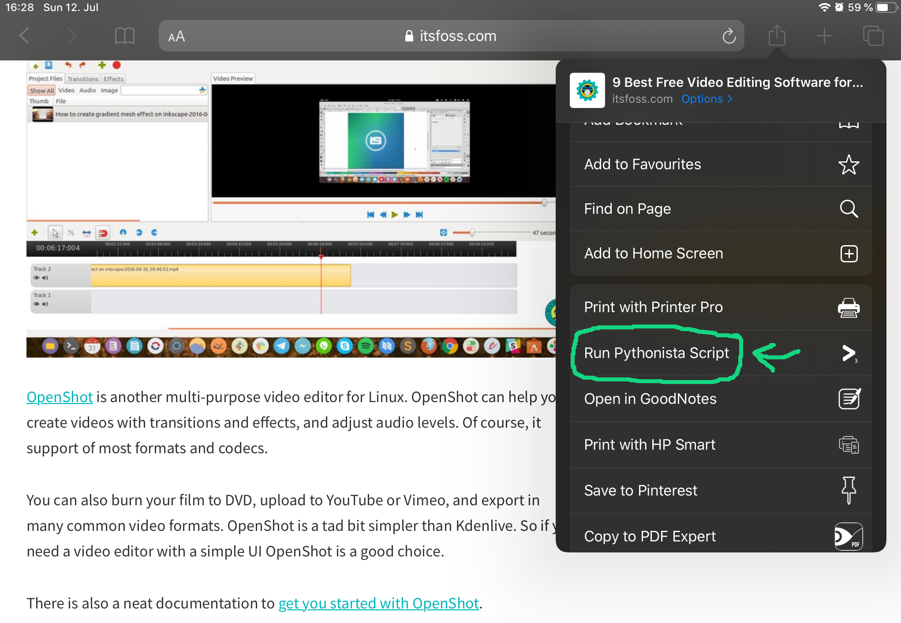
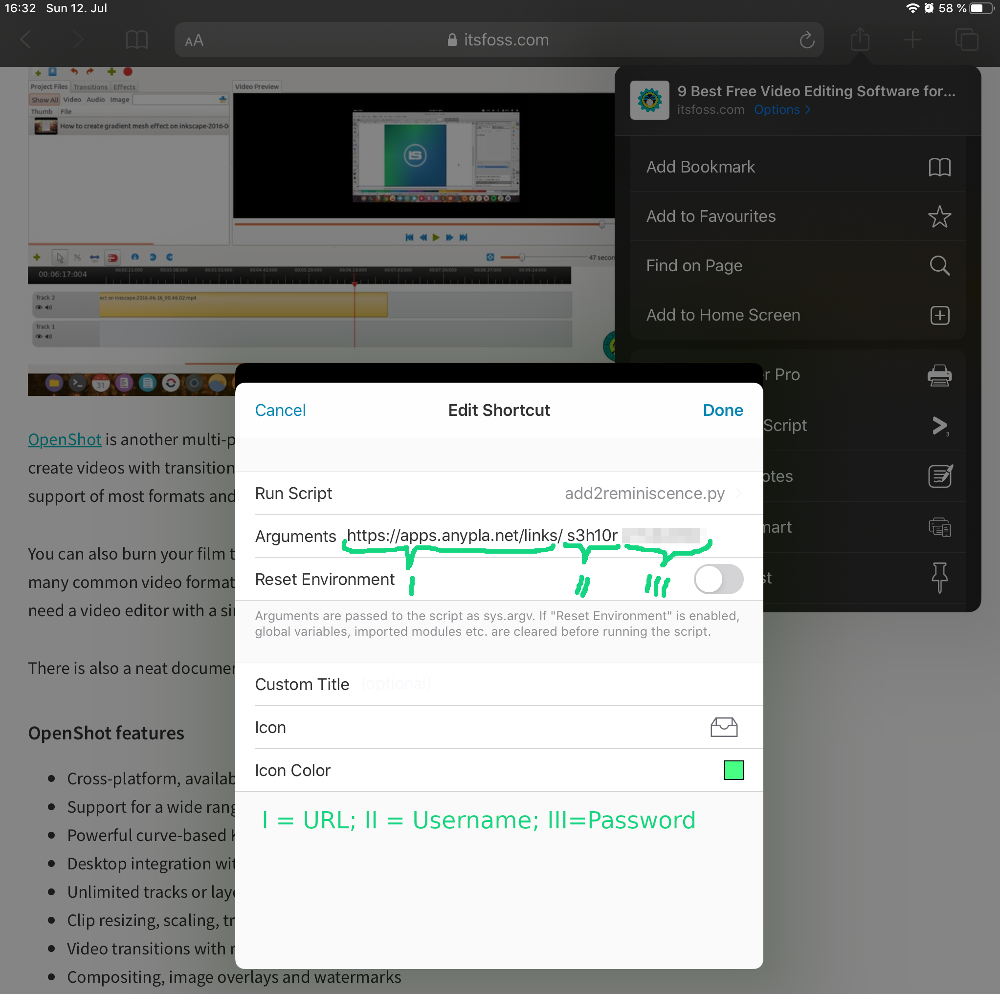
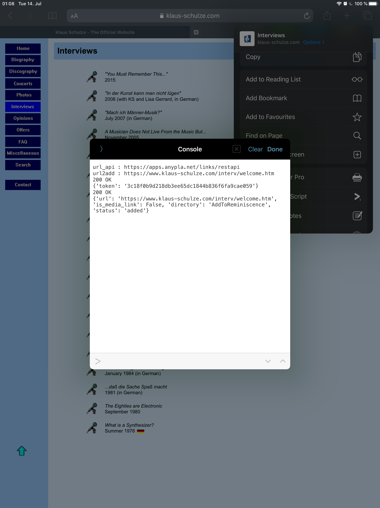

# sharewith-iOS

HOWTO use iOS-apps-"share with"-menu to call (custom) python(ista)-scripts by example

## AddToReminiscence

[Reminiscense](https://github.com/kanishka-linux/reminiscence) is an 
open-source self-hosted bookmark and archive manager.

This example shows you how to send/archive a page/URL from your mobile 
browser via the "share with"-menu. 
This is done by using [Pythonista3](http://omz-software.com/pythonista/) 
to call a short Python-script ([`add2reminiscence.py`](add2reminiscence.py)). The script uses 
Reminiscence's REST-API and runs on any platform Python runs on.

requirements:

- [Pythonista3](http://omz-software.com/pythonista/) - A full PythonIDE for iOS (non-free :-/)
- (optional) [StaSh](https://github.com/ywangd/stash/) - a serious attempt to implement a Bash-like shell for Pythonista.

### How to add a pythonista Shortcut

1. select "share with"/"Run Pythonista Script" in your browser

2. select "Edit" and use the "+" symbol to add a new Shortcut (here our Python-script)
3. select the `add2reminiscence.py`-Script 
4. fill in the 3 needed **arguments for the script**: &lt;url-of-your-reminiscence-instance&gt; &lt;user&gt; &lt;password&gt;

5. (optional) choose a fancy icon and color ;)
6. click "Add" and then "Done"

### How to use the pythonista Shortcut

1. select "share with"/"Run Pythonista Script" while browsing the url you want to archive
2. select "add2reminiscence"

